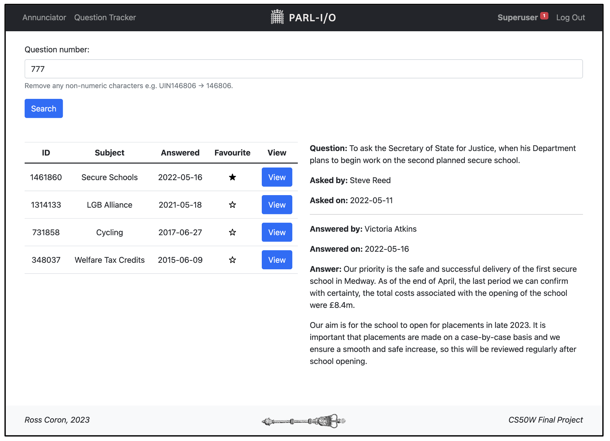

# Parl-I/O

Hello World!

Welcome to Parl-I/O ('*Parlio*'), designed and implemented as my final project for Harvard's [CS50 Web Programming with Python and JavaScript](https://cs50.harvard.edu/web/2020/) course. Parl-I/O is a web application written primarily in Python (Django) and JavaScript.

[](https://youtu.be/p1dJaElP5GQ)

### What is Parl-I/O?

Making use of the [UK Parliament](https://www.parliament.uk/)'s public API, Parl-I/O provides the real-time sitting status of both Houses of Parliament (House of Commons and House of Lords); allows users to search and view [written Parliamentary questions](https://questions-statements.parliament.uk/) (PQs); bookmark questions for later viewing; and set up alert notifications for unanswered questions. Parl-I/O additionally provides basic user-handling, allowing visitors to create an account for the application as well as log in and out.

Watch a video walkthrough of Parl-I/O [HERE](https://youtu.be/p1dJaElP5GQ)!

### Quickstart

```
# Create new migrations
python3 manage.py makemigration

# Migrate
python3 manage.py migrate

# Start development server 
python3 manage.py runserver

# In browser, navigate to generated URL (typically local host http://127.0.0.1:8000/)
```
To navigate Parl-I/O, use the app's NavBar. All pages (except the app's index page) requires the user to have an account with the application and be signed in (go to **Register** / **Log In)**. Parl-I/O's default **Index** page displays the live sitting status of Parliament; **Questions** allows users to search, view, bookmark, and set up Parliamentary Question alerts; **User** displays a user's bookmarked questions and notifications.

## Backend

### File Structure

Parl-I/O follows a typical [Django file structure](https://django-project-skeleton.readthedocs.io/en/latest/structure.html). Python code corresponding to each of the app's 'views' (both visible and API) is stored in the file `views.py`. The site's various URL patterns can be found in `urls.py`.  The app's in-built database is built on three tables (User, Question, and Notification) defined in the file `models.py`, with the database saved as `db.sqlite3`.

The website consists of six HTML pages, most of which extend from a layout file (`layout.html`) using Django's templating language. These files are stored in the `templates` directory. `index.html` (the app's default route), displays Parliament's sitting status; `question.html` allows users to search, view, bookmark, and set up Parliamentary Question alerts; `user.html` displays a user's bookmarked questions and notifications.

The `static` folder contains two sub-folders: `media`, which stores the app's images, icons, and sound files, and `js` which stores the app's JavaScript code. Most of the JavaScript files correspond to a single webpage, but `background.js` (which continually checks if a user has any notifications) is shared between multiple pages. Parl-I/O's custom CSS and animations are stored in `style.css`. 

Outside of these core files, the app's dependencies can be found in `requirements.txt` and environment variables in `.env`.

### How Parl-I/O Works

Parl-I/O is a web application written in Python, JavaScript, HTML, and CSS. The application contains a SQLite database, with data managed through Python objects ('models'). Parl-I/O utilises the Django web framework and Bootstrap CSS framework.

Parl-I/O make use of the UK Parliament's [Developer Hub](https://developer.parliament.uk/), particularly the 'Written Questions' and 'Parliament Now' APIs. The application has 7 'visible' URL routes (i.e. routes which render an HTML page) and 6 'API' routes. Querying Parliament's APIs and / or updating the app's underlying database, these routes: 
 1. Check if a selected question is on a user's watchlist
 2. Check if an unanswered question has now been answered
 3. Bookmark / unbookmark a question
 4. Add / remove a question from a user's watchlist
 5. Checks the current sitting status of Parliament
 6. Dismisses a user's notification

While Python does most of Parl-I/O's heavy lifting (rendering HTML pages, updating the app's database, processing data, etc.), JavaScript is used to retrieve data (typically in the form of asynchronous `fetch` functions, passing over to backend API functions (described above) for processing) and update HTML pages as required.

## Et al.

### Distinctiveness and Complexity

Built from scratch (i.e. an empty Django template, *not* the programming language!) Parl-I/O utilises many of the tools and techniques covered in CS50W. By providing bookmarking and notification functionality by combining a public API and inbuilt database, Parl-I/O goes beyond a simple API querier, significantly building on Parliament's own website. 

Created to address challenges in my professional role in Parliament, and incorporating a number of techniques **not** covered in CS50W, Parl-I/O is distinct from, and significantly larger and more complex than the course's previous PSETs.

In respect to CS50W's other grading requirements, Parl-I/O is mobile responsive, utilises Django (with three associated models), and JavaScript as described above.

### Acknowledgements

- Elizabeth Tower (Big Ben) favicon - [LINK](https://www.flaticon.com/free-icon/big-ben_774156?term=big%20ben&page=1&position=1&origin=search&related_id=774156)
- House of Commons / Lords icons - [LINK](https://www.parliament.uk/globalassets/documents/foi/181321bg.pdf)
- Parliament's Developer Hub - [LINK](https://developer.parliament.uk/)
- CS50W - [LINK](https://cs50.harvard.edu/web/2020/)


### About Me

Hi, I'm Ross Coron! I'm a driven, creative, and experienced policy professional. I have a proven track record of furthering the Government's agenda as a Civil Servant and in scrutinising its work as a Policy Analyst in the House of Lords. I previously worked at Blood Cancer UK (policy / public affairs) and the University of St Andrews, Institut Pasteur, and Imperial College London (PhD and postdoctoral research). I'm interested in all-things policy, programming, pipetting. 

Let's connect!
 - LinkedIn - [LINK](https://www.linkedin.com/in/ross-coron/)
 - Twitter - [LINK](https://twitter.com/Ross_Coron)
 - GitHub - [LINK](https://github.com/Ross-Coron)
 - Medium - [LINK](https://medium.com/@rpcoron)

<hr>
